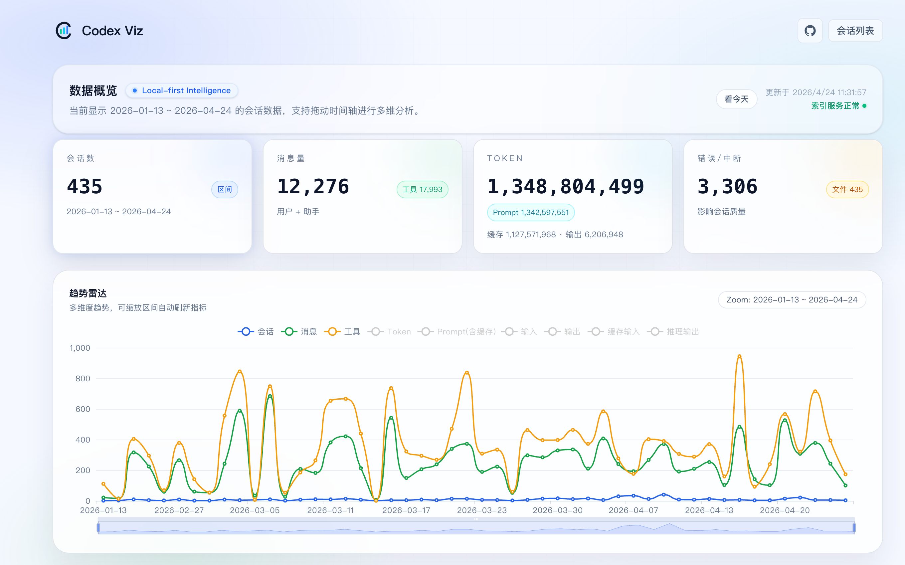
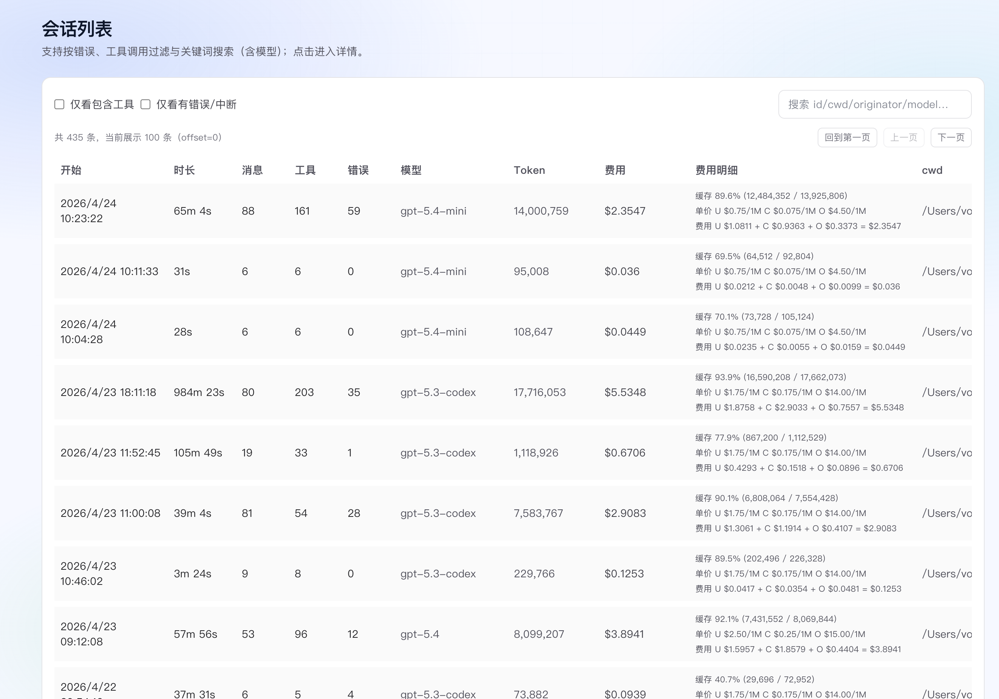

# Codex Viz Plus

<p align="center">
  
  
</p>

Codex Viz Plus 是基于 [onewesong/codex-viz](https://github.com/onewesong/codex-viz) 改造的本地会话分析面板。
它继续读取本机 Codex CLI 的 JSONL 历史，同时补上了模型识别、费用估算、今天筛选和更完整的列表信息展示。

如果你想快速看清“今天跑了多少会话”“花了多少 Token”“大概花了多少钱”，这里会比原版更直接。

## 新增功能

- 会话模型识别：从原始 `turn_context.payload.model` 读取模型
- 会话列表增强：新增模型、Token 总量、费用、费用明细列
- 费用估算：按输入、缓存输入、输出三段单价拆分计算
- 今天筛选：首页支持一键切换“看今天 / 看全部”
- 今天全局联动：首页总览、趋势图、工具榜、词云都能按当天过滤
- 模型搜索：会话列表搜索支持按模型名匹配
- 详情增强：会话详情页展示模型和 Token 统计

## 费用怎么算

- `缓存了多少` = `tokensCachedInput`
- `未缓存输入` = `max(tokensInput - tokensCachedInput, 0)`
- `缓存比例` = `tokensCachedInput / tokensInput`，如果 `tokensInput = 0`，则显示 `—`
- `缓存价格` = `cached input price / 1M tokens`
- `没缓存价格` = `input price / 1M tokens`
- `输出价格` = `output price / 1M tokens`
- `总费用` = `未缓存输入费用 + 缓存输入费用 + 输出费用`
- 如果模型没有对应公开价格，则费用显示 `无公开价格，未统计`

## 快速开始

```bash
pnpm i
pnpm dev
```

打开 `http://localhost:3000`

## 配置

- `CODEX_SESSIONS_DIR`：默认 `~/.codex/sessions`
- `CODEX_VIZ_CACHE_DIR`：默认 `~/.codex-viz/cache`

## 说明

本项目保留原始 MIT License 约束，详见 `LICENSE`。
